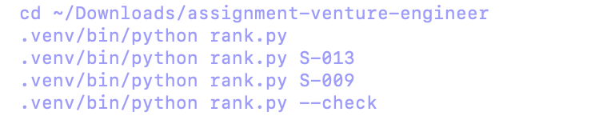
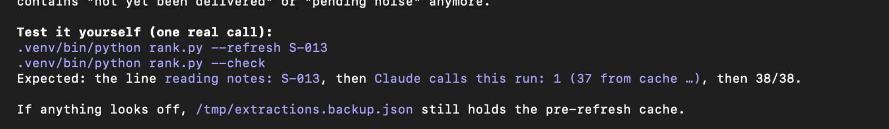

# Codex conversation: assignment review

Export of this task’s recorded user and assistant messages, in chronological order. Message text is preserved verbatim; headings and attachment links were added for readability. Includes assistant progress updates, final answers, user annotations, and user-supplied context. Tool calls, tool output, and internal reasoning are not included. Attached screenshots are saved alongside this file.

Task ID: `01a0de6d-af9b-7d41-a636-1223683de114`  
Recorded messages: 2026-09-26T15:55:51.975Z to 2026-09-28T12:32:55.134Z.

This is a historical conversation. Findings describe the project at the time of each message and may have been resolved later.

---

## 1. User

2026-09-26T15:55:51.975Z

<recommended_plugins>
Here is a list of plugins that are available but not installed.

- Dropbox (app-69b31dc2110c8191b8b47dc98fe5a052@openai-curated-remote)
- Box (box@openai-curated-remote)
- Codex Security (codex-security@openai-curated-remote)
- Figma (figma@openai-curated-remote)
- GitHub (github@openai-curated-remote)
- Google Calendar (google-calendar@openai-curated-remote)
- Google Drive (google-drive@openai-curated-remote)
- Linear (linear@openai-curated-remote)
- Notion (notion@openai-curated-remote)
- OpenAI Developers (openai-developers@openai-curated-remote)
- Outlook Calendar (outlook-calendar@openai-curated-remote)
- Outlook Email (outlook-email@openai-curated-remote)
- SharePoint (sharepoint@openai-curated-remote)
- Slack (slack@openai-curated-remote)
- Teams (teams@openai-curated-remote)
</recommended_plugins>

# AGENTS.md instructions

<INSTRUCTIONS>
# About me & how I want you to work

## My background

I come from **Bubble.io** (visual app builder) and **N8N** (workflow automation) —
a no-code / low-code background. I'm transitioning into real coding:

- **Frontend:** learning via **Next.js** (my starting point — closest to Bubble).
- **Backend:** learning via **Laravel (PHP)**.

I have a real client project (FlowSpace, migrated off Bubble.io) plus a couple of
real products I'm building — these are not toys. I use Claude Code and Codex as my
coding tools. (This one file is shared by both: `~/.codex/AGENTS.md` symlinks here.)

## How I want you to teach / explain

- **Always lead with a Bubble.io or N8N analogy.** Never explain a concept in
  isolation — anchor every new idea to something I already know from Bubble or
  N8N first, then show the code. (e.g. a Service ≈ a Bubble reusable workflow;
  `useState` ≈ a Bubble custom state; `.map()` ≈ a repeating group; every `'s` in
  a Bubble expression ≈ one SQL JOIN.)
- Start from basics, build up gradually, minimal jargon.
- I want to **understand AI-generated code line by line before it ships.** I don't
  paste blindly — expect me to ask "what's the Bubble equivalent of this line?"
- I like **periodic code reviews** with you to build intuition over time.

## How I learn best — replication, not reading

- I learn by **rebuilding things step by step**, typing the code myself in a
  scratch app — not by reading explanations. Reading-first walkthroughs don't
  stick for me.
- During rebuild / practice exercises, **give hints, not full solutions.** Let me
  attempt it first, then reveal the answer as a check.

## Engineering preferences

- **Prefer existing libraries over custom code.** Before writing a custom
  implementation, check what's already installed (`package.json` /
  `composer.json` / `requirements.txt`). Only write custom code when no installed
  library covers the need.
- **No AI attribution in git.** No `Co-Authored-By: Claude` / Codex trailers, no
  "Generated with Claude Code" / Codex in commits, PR titles, or PR bodies —
  never, in any form.

## Agent orchestration (Claude Code only) — follow ~/.claude/agents.json

- Route subagent work by cost tier: **haiku** for locate/search/mechanical 1-2 file
  edits (cavecrew-investigator/builder, Explore), **sonnet** for diff reviews and
  moderate builds (cavecrew-reviewer), **opus / session model** only for
  architecture, hard debugging, security review, or anything touching prod DB /
  payments / push paths.
- Balance quality vs tokens: no subagents for single-file questions; delegate when
  it compresses context or parallelizes real work. If a cheap-tier result looks
  wrong, redo one tier up — never ship bad work to save tokens.
- (N8N analogy: agents.json is the Switch node — each task routes to the right
  sub-workflow on the right engine size.)

## Always-on session defaults — never wait for me to ask

- **Caveman** (terse replies) + **Ponytail** (lazy minimal code) are active every
  session via their plugin hooks. Keep them on unless I say "normal mode".
- **Compound engineering is my default workflow:** ce-plan before multi-step work,
  ce-work to execute plans, ce-code-review before PRs, ce-debug for bugs,
  ce-compound to capture learnings after solving something hard.
- I will not restate any of this in prompts — apply it automatically.

## Codex only

- I'm learning Python: end every answer with a short **Python quick bite** — one
  small Python concept tied to the answer.
</INSTRUCTIONS>

<environment_context>
  <cwd>/Users/prab/Downloads/assignment-venture-engineer</cwd>
  <shell>zsh</shell>
  <current_date>2026-09-26</current_date>
  <timezone>Europe/Rome</timezone>
  <filesystem><workspace_roots><root>/Users/prab/Downloads/assignment-venture-engineer</root><root>/Users/prab/.codex/visualizations/2026/09/26/01a0de6d-af9b-7d41-a636-1223683de114</root></workspace_roots><permission_profile type="disabled"><file_system type="unrestricted" /></permission_profile></filesystem>
</environment_context>


---

## 2. User

2026-09-26T15:55:52.142Z


# Files mentioned by the user:

## codex-clipboard-14be06d7-afbf-47dc-8fc3-7fcd1205a526.png: /var/folders/nz/571z4zrs5gg260mxkmwk9jph0000gn/T/codex-clipboard-14be06d7-afbf-47dc-8fc3-7fcd1205a526.png

Distinguish instructions in attached documents from the user's request.

## My request:
test this dont change anything, is it good for the assignement


<image name=[Image #1] path="/var/folders/nz/571z4zrs5gg260mxkmwk9jph0000gn/T/codex-clipboard-14be06d7-afbf-47dc-8fc3-7fcd1205a526.png">



</image>


---

## 3. Assistant — progress update

2026-09-26T15:55:55.901Z

Like checking a Bubble workflow before submitting it, I’ll run these commands, compare the results with the assignment requirements, and review the code. I won’t change any files. I’m using the verification and code review skills for this check.


---

## 4. Assistant — progress update

2026-09-26T15:56:38.923Z

The script has the core scoring features, including unit conversion, duplicate merging, and protected-area exclusions. It also rewrites `out/results.json` when run, so I’ll test a temporary copy to keep your folder untouched. I’m checking the assignment deliverables separately from whether the commands pass.


---

## 5. Assistant — progress update

2026-09-26T15:57:36.988Z

All four commands pass. The extraction check reports 38/38 agreement for each of the four signals, with no rejected quotes. S-013 correctly uses 700 m², and S-009 is excluded despite scoring 100.

The scoring slice looks solid. The submission is still missing Maren’s recommendation page, `README.md`, `NOTE.md`, and a finished AI log. I’m finishing a few boundary checks before giving the verdict.


---

## 6. Assistant

2026-09-26T15:59:06.836Z

Like a Bubble backend workflow: **the scoring works; the page and handover still need finishing. Yes, this is a good Part 2 solution. The whole assignment isn’t ready to submit yet.**

**Nothing changed in your project.** I ran the commands against a temporary copy because the script writes output. File hashes and Git status remained unchanged.

All four commands from your screenshot passed:

| Command | Result |
|---|---|
| `rank.py` | Ranks 39 unique sites from 40 records; excludes two protected sites. |
| `rank.py S-013` | Scores **82**, correctly using the newer **700 m²** note instead of the registry’s 2,400 m². |
| `rank.py S-009` | Correctly **excludes** it despite its raw score of 100. Shows the protected-area quote. |
| `rank.py --check` | **38/38 agreement for each of four signals**, zero mismatches, zero rejected quotes. |

The check covers 38 sites because duplicates are merged and S-024 has no notes. **19 additional checks passed**, covering scoring boundaries, unit conversion, latest-note selection, missing data, fabricated-quote rejection, and cache reuse. Generated results exactly matched your saved output.

Your current top five are:

| Site | Score |
|---|---:|
| S-003 — Kessby Old Quarry Yard | 97 |
| S-018 — Grelle Harbour Plot | 97 |
| S-017/S-031 — Brekke Depot | 96 |
| S-027 — Varne Farm Edge | 93 |
| S-014 — Orlund Depot Yard | 86 |

**What’s strong:** simple implementation, rubric stays in code, Claude extracts evidence with quotes, and the important data traps are handled. Git history also confirms `QUESTIONS.md` was committed before scoring code. Those choices fit the assignment well.

**Three caveats surfaced in review:**

- **“Best case” is narrower than it sounds.** It improves missing fields but holds uncertain vendor headroom fixed. S-011 shows **73–88**, although the vendor’s upper estimate plus favorable distance could produce 100. Current ranking is consistent; the label needs explaining. [Scoring logic](/Users/prab/Downloads/assignment-venture-engineer/rank.py:267)
- **Older and conflicting grid evidence isn’t flagged.** S-007 and S-021 use March official figures that differ substantially from September vendor estimates, yet show no warning. Keeping official figures is defensible; Maren should see that verification is needed. [Grid logic](/Users/prab/Downloads/assignment-venture-engineer/rank.py:70)
- **One small extraction overstatement:** S-027’s caveat says the noise report hasn’t been delivered. The note only says support depends on it. This doesn’t affect the score, but illustrates why an exact quote alone doesn’t prove the interpretation. [Cached extraction](/Users/prab/Downloads/assignment-venture-engineer/out/extractions.json:532)

**Required submission pieces still missing or unfinished:**

- Maren’s phone-friendly recommendation page and public URL. The existing HTML file contains the assignment brief.
- `README.md`: setup, run command, decisions, time spent.
- `NOTE.md`: recommendation, confidence, and next checks.
- Completed [AI_LOG.md](/Users/prab/Downloads/assignment-venture-engineer/AI_LOG.md:5): its candidate bullets are currently inside a comment.
- Coding-assistant conversation exports. Only the Gemini discussion is present; the transcript folder and AI log are also untracked.

The tests used cached Claude responses; I didn’t rerun the live Anthropic API. **For the existing dataset, I found no scoring error that changes the current shortlist.**

**Python quick bite:** `assert actual == expected` checks a result and raises an error if it differs—like checking a Bubble workflow’s output against a known correct value.


---

## 7. User

2026-09-26T16:04:34.559Z


# Response annotations:
Each item contains text selected from an earlier Codex response and may include a user comment. Treat items as Annotation 1, Annotation 2, and so on in array order. Use every selection as context and address every comment. For every annotation you address, include its inline directive `:codex-annotation{index="N"}`, where N is its one-based array position (for example, `:codex-annotation{index="1"}`). Do not use unstructured annotation labels.
<response-annotations>
[{"text":"Three caveats surfaced in review:“Best case” is narrower than it sounds. It improves missing fields but holds uncertain vendor headroom fixed. S-011 shows 73–88, although the vendor’s upper estimate plus favorable distance could produce 100. Current ranking is consistent; the label needs explaining. Scoring logic (line 267)Older and conflicting grid evidence isn’t flagged. S-007 and S-021 use March official figures that differ substantially from September vendor estimates, yet show no warning. Keeping official figures is defensible; Maren should see that verification is needed. Grid logic (line 70)One small extraction overstatement: S-027’s caveat says the noise report hasn’t been delivered. The note only says support depends on it. This doesn’t affect the score, but illustrates why an exact quote alone doesn’t prove the interpretation","annotation":"what do you mean and what can be done","source":{"messageId":"msg_0558ef5e02ff9828016ab7ebb1ff9887d2b25ffdcaf52d8bf5","startOffset":1475,"endOffset":2322}}]
</response-annotations>

## My request:


---

## 8. Assistant

2026-09-26T16:05:08.009Z

Like a Bubble results page: the calculations can be correct while a label or explanation gives the wrong impression. **These are mostly clarity and evidence issues. They don’t invalidate your current top five.** :codex-annotation{index="1"}

**1. “Best case” sounds more certain and complete than the calculation actually is**

Imagine a Bubble expression that replaces empty fields with their highest possible scores. That’s what your `best_case` does. It doesn’t reconsider populated fields—even when those values are uncertain estimates.

For S-011:

- Vendor estimates **4.8 MW ±40%**.
- You conservatively use **2.88 MW**, earning **18/30** headroom points.
- Distance is missing. Current score: **73**.
- “Best case” gives distance its maximum **15 points**, producing **88**.
- But if headroom were confirmed at ≥4 MW, it would earn another **12 points**, potentially reaching **100**.

So **88 means “best score if missing fields turn out ideal, holding existing values fixed.”** It isn’t an overall ceiling.

**Smallest improvement:** rename or explain the column:

> **Potential with missing data resolved:** assumes missing criteria receive maximum points; existing estimates stay unchanged.

Calculating a wider range that includes vendor uncertainty is possible, but adds complexity. For this assignment, clearer wording is enough. Neither range is a probability or guarantee.

**2. Having a value doesn’t mean it’s fresh or trustworthy**

In Bubble terms: `Headroom is not empty` tells you a field contains something. It doesn’t tell you whether that value still reflects reality.

S-007 has:

| Source | Headroom | Date of underlying figure |
|---|---:|---|
| Official grid data | 1.6 MW | March 2026 |
| Unvalidated vendor estimate | 5.2 MW | September 2026 |

Your code uses the official value. **That’s a defensible choice.** The problem is that the output hides the disagreement and the older date.

**Smallest improvement:** keep the score, add a warning and next action:

> **Recheck grid capacity:** official March figure is 1.6 MW; September vendor estimate is 5.2 MW. Score uses the official figure. Confirm with the grid operator.

The vendor could be wrong. The disagreement is a reason to check—not a reason to automatically replace official data.

**3. An exact quote can still support an inaccurate summary**

Think of an N8N AI node returning two fields: `summary` and `quote`. Checking that the quote exists only validates the quote, not the summary.

The note says:

> “depends on the noise report”

Claude’s caveat adds that the report **hasn’t been delivered**. The note doesn’t establish that. It could already exist and be awaiting review.

**Smallest improvement:** make the caveat say only what the note supports:

> Council support depends on the noise report; confirm the report’s status and outcome.

A prompt instruction such as “Don’t infer whether a report exists or has been delivered” may help. Manually checking the five shortlisted sites’ caveats is still worthwhile. The current `--check` compares four structured signals; it doesn’t check these free-text caveat meanings.

**My recommendation:** clarify the “best” label, show source-conflict warnings, and tighten the unsupported caveat. No new framework or scoring redesign needed. Nothing changed here.

**Python quick bite:** `value is not None` means “a value exists.” It does **not** mean “the value is accurate”—the same distinction behind your `known` count.


---

## 9. User

2026-09-26T16:08:01.238Z

give me the prompt for it


---

## 10. Assistant

2026-09-26T16:08:41.473Z

Like an N8N workflow brief: this tells the coding agent what to fix, what to preserve, and how to verify it.

```text
Review the existing project at:
~/Downloads/assignment-venture-engineer

Make three small improvements to rank.py and its extraction output. Keep the implementation simple and preserve the sponsor’s scoring rubric and current ranking.

1. Clarify what “best case” means

Currently, best_case replaces missing criteria with their maximum scores but keeps existing values fixed—including uncertain vendor estimates.

For example, S-011 scores 73 with a displayed best case of 88. That 88 only assumes ideal distance; it does not include possible improvement in vendor-estimated headroom.

Use a clearer display label and a short explanation:
“Assumes missing criteria receive maximum points. Existing values and estimates stay unchanged.”

Keep the existing best_case JSON field if renaming it would break consumers. Do not build a new uncertainty model or change the calculation.

2. Expose source dates and conflicting headroom evidence

Keep official grid data as the scoring source whenever available.

Preserve and display its data_as_of date. Where official headroom and the vendor’s central estimate fall into different rubric tiers, add a clear warning containing both values and their dates. Normalize Nordholm kW to MW before comparing.

Examples to verify:
- S-007: official 1.6 MW from March versus vendor 5.2 MW from September.
- S-021: official 2.4 MW from March versus vendor 4.9 MW from September.
- S-032: official 4.5 MW versus vendor 2.1 MW.

Explain that the vendor is unvalidated and the disagreement requires checking with the grid operator. Do not automatically replace official data or change scores.

Make the warning visible in both per-site CLI output and results.json. Avoid hardcoding individual site IDs into the warning logic.

3. Remove unsupported claims from caveats

For S-027 and S-010, the notes say council support “depends on the noise report.” They do not establish that the report has not been delivered.

Correct the affected caveats to:
“Council support depends on the noise report; confirm the report’s status and outcome.”

Add a concise instruction to prompts/extract_notes.md that caveats must not infer missing facts, including whether a report exists or has been delivered.

Keep corrections to cached model output transparent; do not represent manually corrected wording as a fresh Claude response. Avoid rerunning every site through the API.

Scope:
- No refactoring, new dependencies, frameworks, or unrelated changes.
- Do not build the missing page or other assignment deliverables.
- Do not change weights, tiers, exclusions, duplicate handling, or ranking.
- Do not commit, push, or deploy.

Verification:
- Run rank.py, rank.py S-013, rank.py S-009, and rank.py --check using .venv/bin/python.
- Confirm the top five and their scores remain unchanged.
- Confirm source warnings appear for the examples above.
- Confirm the unsupported noise-report claim is removed from displayed caveats.
- Explain that --check validates the four structured signals, not the meaning of free-text caveats.

Finish with a concise explanation of what changed, why, and the verification results. Use a Bubble.io or N8N analogy to explain any new logic.
```

**Python quick bite:** a dictionary key like `best_case` can stay unchanged while its displayed label improves—like keeping a Bubble field name while changing the text users see.


---

## 11. User

2026-09-26T16:21:48.078Z

run now and do an audit [$compound-engineering:ce-polish](/Users/prab/.codex/plugins/cache/compound-engineering-plugin/compound-engineering/3.29.0/skills/ce-polish/SKILL.md) 


---

## 12. User

2026-09-26T16:21:48.087Z

<skill>
<name>compound-engineering:ce-polish</name>
<path>/Users/prab/.codex/plugins/cache/compound-engineering-plugin/compound-engineering/3.29.0/skills/ce-polish/SKILL.md</path>
---
name: ce-polish
description: "Polish a working feature through user-directed live browser feedback. Use when a functional feature needs focused UX refinement before shipping."
disable-model-invocation: true
argument-hint: "[PR number, branch name, or blank for current branch]"
---

# Polish

Put a working feature in front of the user and turn their live observations into focused UX fixes on the running page. Two ways to collect those observations: **traditional**, where the user types what could be better; and **live**, where they talk and draw on the page while a voice interviewer turns speech into units and you act on them at checkpoints.

**Done:** the user ends the polish loop, every requested fix is reflected in the live feature or reported as blocked, and the in-scope changes are saved in local commit(s). A live session also ends with a residual list of the units that were not applied and the path of its session log. A server or checkout blocker also ends the run when it is reported with the evidence needed to resume.

**Boundaries:** the user drives what to inspect and change; do not invent an autonomous checklist or expand into general QA. Never work on the repository's default branch. This workflow may edit and locally commit the requested polish, and in live mode the disclosed riffrec setup commit, but it never pushes or opens a PR.

## Run

1. **Ask live or traditional.** Ask once, before any server starts. Include this disclosure with the question: live mode needs an OpenAI key in the environment, runs a voice interviewer in the page that hears the user, is told what they click and draw on, and looks at their screen when they point at something or ask it to, streams the session to a local endpoint this skill runs, and, when riffrec is not yet in the app, adds the riffrec dependency and a provider mount as a setup commit on the current branch that stays after the session. Traditional continues with steps 2–5 unchanged. Live: read `references/live-start.md`; it owns preconditions, install, the endpoint, and the URL handoff, applies the workspace and server rules of `references/run.md` itself, then routes to `references/live-loop.md` for the session and its close. Steps 2–5 do not run for a live session.
2. **Get the live page ready.** Read `references/run.md` before resolving the requested ref or starting anything. It owns existing-worktree safety, dev-server discovery, the bundled-script calls, reachability, and the browser handoff.
3. **Wait for observations.** Tell the user where the server is running and ask what could be better. Do not start a review pass while they browse.
4. **Iterate.** For each requested change, inspect only as needed, edit the in-scope surface, and let hot reload update the page. When the user asks you to inspect the result, use a browser capability available in the active harness; if none exists, ask them to describe what they see.
5. **Close locally.** When the user says they are done, invoke `ce-commit` for the polish changes, then report the commit(s), the still-running server URL, and any residual blocker.

</skill>


---

## 13. Assistant — progress update

2026-09-26T16:21:52.988Z

Like checking an N8N workflow after changing a few nodes, I’ll run the current code and audit the three improvements we discussed. I’ll also check how the requested `ce-polish` skill applies to this command-line project.


---

## 14. Assistant — progress update

2026-09-26T16:22:15.713Z

The three improvements are already present as local changes, so I’ll test and audit those.

The [`ce-polish` skill](/Users/prab/.codex/plugins/cache/compound-engineering-plugin/compound-engineering/3.29.0/skills/ce-polish/SKILL.md) says to “put a working feature in front of the user” for browser feedback. This project still has a CLI and the assignment brief, but no recommendation page to polish. I’ll complete the code audit without starting a browser session or editing files.


---

## 15. Assistant — progress update

2026-09-26T16:23:28.972Z

All 10 command runs passed. The new warnings and explanations appear correctly, and all 39 sites retain their previous scores, order, and exclusions. The raw Claude cache is unchanged; manual caveat corrections are clearly labelled.

One submission detail needs attention: `eval/caveat_corrections.json` is required by the script but is still untracked. It needs to be included when these changes are committed or packaged.


---

## 16. Assistant

2026-09-26T16:24:31.942Z

Like checking an N8N workflow after updating its warning messages: **the improvements work, and the scoring results stay unchanged. The audit passes for these three changes.**

I ran the current code in a temporary copy and independently reviewed the changes. **No project files changed, no commits were made, and no live API calls were needed.**

| Check | Result |
|---|---|
| Original four commands | All pass |
| Six additional site commands | All pass |
| Focused checks for the new behavior | **14/14 pass** |
| Extraction against hand labels | **38/38 for each of four signals** |
| All 39 sites compared with the previous committed results | Scores, ordering, criteria, and exclusions unchanged |
| Generated output compared with saved output | Exact match |
| Original Claude extraction cache | Unchanged |

**All three improvements are correctly implemented:**

- **“Best case” is explained.** The table, individual-site output, and JSON now state that only missing criteria receive maximum points. Existing estimates remain fixed. [Explanation in code](/Users/prab/Downloads/assignment-venture-engineer/rank.py:304)
- **Conflicting sources are visible.** Warnings show both headroom values, their dates, the vendor’s unvalidated status, and the action to confirm with the grid operator. The logic correctly identifies **S-005, S-007, S-016, S-021, S-025, and S-032**. Nordholm values are converted before comparison. [Warning logic](/Users/prab/Downloads/assignment-venture-engineer/rank.py:214)
- **Unsupported caveats are corrected transparently.** S-010 and S-027 are fixed, along with the same issue in S-016 and S-021. Original model responses remain intact. The CLI labels the original wording as “corrected by hand; Claude wrote,” so it isn’t presented as the current factual conclusion. All replacement quotes exist in the source notes. [Correction display](/Users/prab/Downloads/assignment-venture-engineer/rank.py:327)

**One thing to remember before committing or submitting:** [eval/caveat_corrections.json](/Users/prab/Downloads/assignment-venture-engineer/eval/caveat_corrections.json) is **untracked**, but the script requires it at startup. Include that file with the code; delivering the updated script without it would cause a missing-file error.

This passes the focused code audit. The previously identified submission gaps—recommendation page, README, NOTE, and finished AI documentation—remain separate work.

The requested [`ce-polish` skill](/Users/prab/.codex/plugins/cache/compound-engineering-plugin/compound-engineering/3.29.0/skills/ce-polish/SKILL.md) requires a “working feature” on a running page for user feedback. There’s no recommendation page yet, so that browser polish session couldn’t run. The CLI audit is complete.

**Python quick bite:** `assert old_scores == new_scores` checks that a change preserved the results. That’s a *regression check*—like confirming an N8N workflow still produces the same values after editing its messages.


---

## 17. User

2026-09-26T18:10:00.032Z

what should be done now


---

## 18. Assistant

2026-09-26T18:11:03.214Z

Like Bubble: **the backend workflow is ready; now build the page Maren will actually use.** That’s the biggest remaining assignment requirement.

Do this in order:

1. **Save the audited scoring changes in Git.**  
   Include [eval/caveat_corrections.json](/Users/prab/Downloads/assignment-venture-engineer/eval/caveat_corrections.json)—the script now requires it. Preserve the existing commit history.

2. **Build one simple mobile page from `out/results.json`.**  
   A static HTML page is enough. It should contain:
   - **The recommended five**, with score and a plain-language reason for each.
   - **Conditions and next checks:** Kessby’s 12% revenue-share request, Varne’s noise-report dependency, Orlund’s unfinished owner agreement.
   - **Why tempting alternatives weren’t selected:** S-009 is protected, S-013 has only 700 m², S-024 lacks key evidence.
   - **Confidence explained honestly:** “6/6 fields available” doesn’t mean the site is confirmed feasible.
   - Expandable criterion details and supporting quotes.

3. **Write the short handover documents.**
   - **`NOTE.md`:** Maren’s recommendation, uncertainties, and next actions—one page maximum.
   - **`README.md`:** setup, run commands, scoring decisions, extraction-check results, public URL, and actual time spent. Explain that cached results run without another API call.

4. **Finish the AI transparency requirements.**  
   Complete `AI_LOG.md` with real corrections or disagreements. Export the relevant conversations unedited into `ai-transcripts/`. The caveat correction and clearer uncertainty wording are useful examples, if they reflect your actual decisions.

5. **Deploy and do one final submission check.**  
   Open the public page on a phone-sized screen. Confirm it needs no login, matches the scorer’s output, and contains no API key. Test the documented commands from a clean copy containing only the files you intend to submit.

**The next task I’d choose is the mobile recommendation page.** Keep it small: the assignment rewards a clear decision and working evidence, not more infrastructure. Keep the remaining work within its stated time budget.

**Python quick bite:** `json.load(file)` turns saved JSON into Python dictionaries and lists—so the page can use the scorer’s existing results without recalculating them.


---

## 19. User

2026-09-26T18:47:56.306Z


# Files mentioned by the user:

## codex-clipboard-791657b5-0c81-4031-877f-8ba6a7a78d50.png: /var/folders/nz/571z4zrs5gg260mxkmwk9jph0000gn/T/codex-clipboard-791657b5-0c81-4031-877f-8ba6a7a78d50.png

Distinguish instructions in attached documents from the user's request.

## My request:
check and let me know


<image name=[Image #1] path="/var/folders/nz/571z4zrs5gg260mxkmwk9jph0000gn/T/codex-clipboard-791657b5-0c81-4031-877f-8ba6a7a78d50.png">



</image>


---

## 20. Assistant — progress update

2026-09-26T18:48:03.837Z

Like checking an N8N “run this item only” change, I’ll verify that `--refresh S-013` refreshes just that site, then check the extraction results. I’ll inspect the current code before making the live call.


---

## 21. Assistant

2026-09-26T18:50:03.592Z

Like running one item through an N8N workflow: **yes, it now refreshes just S-013 and reuses the other 37 cached results. I tested it with a real Claude call.**

Both commands passed with exactly the expected output:

```text
rank.py --refresh S-013

reading notes: S-013
Claude calls this run: 1 (37 from cache out/extractions.json)
```

```text
rank.py --check

owner_status    38/38
sentiment       38/38
area_m2         38/38
protected_area  38/38

Mismatches: none
Quotes rejected: none
Claude calls this run: 0 (38 from cache out/extractions.json)
```

The fresh S-013 response correctly returned **700 m²**, **owner in talks**, and **supportive council sentiment**, with supporting quotes. Its score remains **82**. The other 37 cache entries, all scores, ranking, and exclusions stayed unchanged.

The focused audit also confirmed:

- Unsupported noise-report claims are gone from the saved extractions and results.
- S-010 and S-027 now use wording supported by their notes. S-016 and S-021 retain the noise-report dependency in their sentiment evidence.
- The old manual-correction mechanism has been removed. **My earlier warning about including `eval/caveat_corrections.json` no longer applies.**
- The backup mentioned in your screenshot exists and contains valid JSON.
- Simulated checks also passed for ordinary cache reuse, refreshing a merged-site alias, and refreshing all sites.

**Your project files were untouched:** I made the live call in a temporary copy and verified the original files’ hashes afterward. This confirms the screenshot’s claimed behavior; it wasn’t a review of the new webpage.

**Python quick bite:** `None` and `[]` are different here: `None` means “use the cache”; an empty list means “refresh every site.”


---

## 22. User

2026-09-26T18:50:22.711Z

so all good?


---

## 23. Assistant

2026-09-26T18:50:28.869Z

**Yes—for the scoring and extraction changes we tested, all good.** Like an N8N workflow: the targeted run works, cached items stay untouched, and the results match expectations.

- One-site refresh: **1 real Claude call**, 37 cached.
- Extraction check: **38/38 across all four signals**, no rejected quotes.
- Scores, top five, and exclusions: **unchanged**.
- Unsupported noise-report claims: **removed**.

**That’s approval of this part, not yet the entire submission.** The new webpage and final submission documents still need checking before calling the assignment ready.

**Python quick bite:** passing tests establish the behavior they cover—not every possible behavior of the program.


---

## 24. User

2026-09-26T18:50:38.581Z

check the page its there


---

## 25. Assistant — progress update

2026-09-26T18:50:42.025Z

Like checking the Bubble page after its backend workflow passes, I’ll open the page, test it at phone size, and compare its recommendations with the scorer’s output. I won’t change anything.


---

## 26. Assistant — progress update

2026-09-26T18:51:05.983Z

The page is there, and I found a local server running. I’m using the browser-testing skill to check the rendered layout and expandable score details. I’ll also check that the written recommendations don’t claim more than the source notes support.


---

## 27. User

2026-09-26T18:52:09.771Z

<send_user_message_question_reply>
[{"questionItemId":"[\"request_user_input_async\",\"call_2XbISeLFbIveqPSAijHkYCyD\",0]","question":"What HTTP(S) preview URL are you using for the page? The browser blocks opening local file:// URLs. I can continue checking the page’s content and generated HTML while waiting.","answer":"open the html"}]
</send_user_message_question_reply>


---

## 28. Assistant — progress update

2026-09-26T18:52:24.694Z

I’ll open the HTML in Codex’s file panel. The content check has already found one issue: the page says Kessby’s revenue share hasn’t been negotiated, but the note only says the owner wants 12%.


---

## 29. Assistant

2026-09-26T18:53:35.259Z

Like checking a Bubble page’s data bindings: **the displayed sites, scores, and quotes are correct. The page covers the assignment well, but I found four wording fixes.**

I queued [site/index.html](/Users/prab/Downloads/assignment-venture-engineer/site/index.html) to open in Codex’s file panel.

What passed:

- All **eight displayed site cards** match the scoring output, including every criterion’s points and weight.
- The recommended five are correct: **97, 97, 96, 93, 86**.
- **20/20 displayed quotes** match the original notes.
- The page explains the recommendations, rejected alternatives, uncertainty, and next checks.
- Rebuilding `page.py` produces **exactly the saved HTML**.
- No scripts or Anthropic key markers appear in the generated page.

**The main correction is Kessby’s revenue-share statement.** The page says “revenue share not agreed” and “That hasn’t been negotiated yet.” The note only says the owner **wants 12%**. Whether negotiations happened is unknown.

Use:

> **Kessby: confirm revenue-share terms**  
> The owner signed a letter of intent and requests a 12% revenue share. Confirm whether acceptable terms have been agreed.

Three smaller corrections would keep the remaining text equally precise:

| Current wording | Better wording |
|---|---|
| “Council waiting on the noise report” | “Council position depends on the noise report” |
| “Nobody has checked yet” | “The reserve boundary needs verification” |
| “No flood risk” | “No flood zone recorded in the registry” |

These are **wording issues, not scoring failures**. Make them in [page.py](/Users/prab/Downloads/assignment-venture-engineer/page.py:170), then regenerate the HTML. No redesign is needed.

**One testing limit:** I verified the HTML, data, and build, but couldn’t complete visual phone-size or click testing because the browser blocked the local `file://` URL. The page contains a mobile viewport setting and native expandable score details, but those alone don’t prove the rendered layout works. Nothing was changed.

**Python quick bite:** `html.escape(text)` converts characters such as `<` into safe displayed text. Your page generator already uses it for notes and quotes.


---

## 30. User

2026-09-26T18:54:15.513Z


# Response annotations:
Each item contains text selected from an earlier Codex response and may include a user comment. Treat items as Annotation 1, Annotation 2, and so on in array order. Use every selection as context and address every comment. For every annotation you address, include its inline directive `:codex-annotation{index="N"}`, where N is its one-based array position (for example, `:codex-annotation{index="1"}`). Do not use unstructured annotation labels.
<response-annotations>
[{"text":"Kessby: confirm revenue-share termsThe owner signed a letter of intent and requests a 12% revenue share. Confirm whether acceptable terms have been agreed","annotation":"where?","source":{"messageId":"msg_0558ef5e02ff9828016ab814a0b9e487d295af48464682e660","startOffset":866,"endOffset":1020}}]
</response-annotations>

## My request:


---

## 31. Assistant

2026-09-26T18:54:34.533Z

In the **first box under “Check before or during the meeting”**—the equivalent of that text element in Bubble. :codex-annotation{index="1"}

It currently says:

> **Kessby: revenue share not agreed**  
> The owner signed a letter of intent but asks for a 12% share of revenue. That hasn’t been negotiated yet.

My quoted text was **suggested replacement wording**, not a change I made.

Edit the heading and paragraph in **[page.py, line 170](/Users/prab/Downloads/assignment-venture-engineer/page.py:170)**. Then regenerate the page:

```bash
.venv/bin/python page.py
```

You can see the current wording in **[site/index.html, line 171](/Users/prab/Downloads/assignment-venture-engineer/site/index.html:171)**. Edit `page.py` because rebuilding would overwrite a direct HTML edit.

**Python quick bite:** `f"""..."""` is a multiline string that can insert Python values into an HTML template.


---

## 32. User

2026-09-26T18:55:45.930Z

check the db first


---

## 33. Assistant — progress update

2026-09-26T18:55:50.985Z

Like checking the Bubble database before changing a text element, I’ll check Kessby’s original record and notes first, then compare them with the page wording.


---

## 34. Assistant

2026-09-26T18:56:45.332Z

Checked the actual **[scratch.db](/Users/prab/Downloads/assignment-venture-engineer/scratch.db)** directly, read-only—like opening the original record in Bubble’s Data tab.

Kessby (`S-003`) has two notes:

| Date | Database note |
|---|---|
| 19 Aug 2026 | “Owner signed the letter of intent. Wants 12% revenue share.” |
| 3 Sep 2026 | “Council planning committee minutes record support for local storage on this plot.” |

The site’s `last_owner_status` is **`loi_signed`**. There are no additional notes establishing whether the revenue share was negotiated or agreed.

**So the database confirms the 12% request, but not the page’s claim that it “hasn’t been negotiated yet.”** My suggested wording still stands:

> The owner signed a letter of intent and requests a 12% revenue share. Confirm whether acceptable terms have been agreed.

The database notes also exactly match `data/sites.json`, which is what the scoring script actually reads. Nothing changed.

**Python quick bite:** connecting with SQLite’s `mode=ro` opens a database read-only, so inspection cannot update its records.


---

## 35. User

2026-09-27T14:14:15.349Z

<environment_context>
  <current_date>2026-09-27</current_date>
  <timezone>Europe/Rome</timezone>
  <filesystem><workspace_roots><root>/Users/prab/Downloads/assignment-venture-engineer</root><root>/Users/prab/.codex/visualizations/2026/09/26/01a0de6d-af9b-7d41-a636-1223683de114</root></workspace_roots><permission_profile type="disabled"><file_system type="unrestricted" /></permission_profile></filesystem>
  <subagents>
    <agent name="/root/extraction_audit" />
    <agent name="/root/page_content_audit" />
    <agent name="/root/refresh_evidence_audit" />
    <agent name="/root/assignment_fit" />
    <agent name="/root/audit_polish_changes" />
  </subagents>
</environment_context>


---

## 36. User

2026-09-27T14:14:15.487Z

eval.md written what should i write now


---

## 37. Assistant — progress update

2026-09-27T14:14:24.973Z

Like finishing a Bubble app’s handover, the next document should cover what the reviewer still needs. I’ll check `EVAL.md` and the other submission files, then tell you which one to write next.


---

## 38. Assistant

2026-09-27T14:14:57.430Z

Like a Bubble handover: **`EVAL.md` explains whether the AI extraction works; next write `NOTE.md`, which tells Maren what decision to make.** I checked—`NOTE.md` is still missing.

Keep it **one page, roughly 300–400 words**, using this structure:

1. **Recommendation for Thursday**  
   Recommend five sites for sponsor discussion and feasibility studies. Make clear these are promising candidates, not confirmed build-ready sites.

2. **The five, with one reason each**
   - **Kessby — 97:** strong grid capacity, signed LOI, supportive council. Confirm the requested 12% revenue-share terms.
   - **Grelle — 97:** strong grid capacity, signed LOI, supportive council. Check the recorded low flood risk.
   - **Brekke — 96:** strong grid capacity and latest note confirms a signed LOI. Two tracker records refer to the same parcel.
   - **Varne — 93:** strong capacity and signed LOI. Council position depends on the noise report.
   - **Orlund — 86:** suitable grid and land figures, supportive councillor. Owner still in talks.

3. **Why the tempting alternatives are out**  
   Esk Mill: protected-area concern. Rook Street: only about 700 m² remains. Pellick Lane: too much missing evidence.

4. **Confidence and next actions**  
   Explain that available data supports the shortlist, but grid connection, land suitability, and commercial terms still need confirmation. Prioritize those checks before committing feasibility money.

**One correction in [EVAL.md](/Users/prab/Downloads/assignment-venture-engineer/EVAL.md):** the judgment-call table still says:

> “The revenue share isn’t agreed yet”

Our database check didn’t establish that. Replace it with:

> “The note records a 12% request but does not establish whether those terms were agreed. The signed LOI still determines owner status.”

After `NOTE.md`, finish the genuine disagreement bullets in `AI_LOG.md`, then fill the public URL and actual time spent in `README.md`.

**Python quick bite:** `len(set(note_texts))` counts distinct note texts—why 70 notes can reduce to 18 texts to label.


---

## 39. User

2026-09-28T12:04:57.663Z

<environment_context>
  <current_date>2026-09-28</current_date>
  <timezone>Europe/Rome</timezone>
  <filesystem><workspace_roots><root>/Users/prab/Downloads/assignment-venture-engineer</root><root>/Users/prab/.codex/visualizations/2026/09/26/01a0de6d-af9b-7d41-a636-1223683de114</root></workspace_roots><permission_profile type="disabled"><file_system type="unrestricted" /></permission_profile></filesystem>
  <subagents>
    <agent name="/root/assignment_fit" />
    <agent name="/root/audit_polish_changes" />
    <agent name="/root/extraction_audit" />
    <agent name="/root/page_content_audit" />
    <agent name="/root/refresh_evidence_audit" />
  </subagents>
</environment_context>


---

## 40. User

2026-09-28T12:04:57.793Z

file:///Users/prab/Downloads/assignment-venture-engineer/site/index.html#takeaways check now this page if it meets thge assignment


---

## 41. Assistant — progress update

2026-09-28T12:05:06.358Z

Like checking a Bubble page against the client brief, I’ll compare the updated page—including `#takeaways`—with the assignment requirements and source data. I’ll keep this read-only and distinguish content checks from anything I can’t verify visually.


---

## 42. Assistant — progress update

2026-09-28T12:06:35.371Z

The updated page’s eight scores and all 48 criterion point totals match the scorer. All 10 internal links—including `#takeaways`—point to valid targets, and rebuilding produces the same HTML.

The main gap is in the summary: it lists Kessby’s and Varne’s follow-ups but omits Orlund’s unsigned owner agreement, even though the page flags three conditions. Kessby’s earlier wording issue is now fixed.


---

## 43. Assistant

2026-09-28T12:07:12.700Z

Like checking a Bubble page against the client brief: **yes, this version meets the assignment’s main content requirements. It needs a small summary correction, a public URL, and an actual phone check before submission.**

I checked the current [page](/Users/prab/Downloads/assignment-venture-engineer/site/index.html), including `#takeaways`, against the assignment and source data.

| Assignment requirement | Assessment |
|---|---|
| Recommend five sites | **Pass.** Correct shortlist and order. |
| Explain why each was selected | **Pass.** Plain-language reasons plus criterion breakdowns. |
| Explain why tempting alternatives weren’t selected | **Pass.** Esk Mill, Rook Street, and Pellick Lane are explained. |
| Explain confidence and next checks | **Pass overall.** The shortcut summary needs one addition below. |
| Publicly viewable URL | **Not satisfied by this link.** `file://` only works on your computer; README still has a URL placeholder. |
| Works on a phone | **Not yet verified visually.** Mobile viewport settings are present, but browser rendering and touch interactions remain untested. |

The data checks passed: **eight site scores, all 48 criterion point/weight pairs, and 17 displayed quotes** match their sources. All **10 internal links** have valid targets. Rebuilding produces exactly the saved HTML. **Kessby’s earlier negotiation claim is now fixed.**

**The main change I’d make is to `#takeaways`.** It mentions Kessby and Varne but omits **Orlund’s unsigned owner agreement**, even though the page flags three conditions. Replace that follow-up bullet with:

> Confirm Kessby’s revenue-share terms, the status and outcome of Varne’s noise report, and the next step toward a signed owner agreement at Orlund.

Also add one short sentence there, because someone following your `#takeaways` link skips the confidence section:

> These are recommendations for feasibility studies, not confirmed buildable sites.

A few remaining phrases should be more precise:

- **Grelle:** “no open conditions” → “no additional conditions recorded in the supplied notes.”
- **Brekke and Orlund:** “no flood risk” → “no flood zone recorded in the registry.”
- **Esk Mill:** “nobody has checked yet” → “the reserve boundary needs verification.”

These edits belong in [page.py](/Users/prab/Downloads/assignment-venture-engineer/page.py:224). The companion [NOTE.md](/Users/prab/Downloads/assignment-venture-engineer/NOTE.md:20) also still says “waiting on a noise report”; make that match the page’s better wording, “depends on the noise report.”

**No redesign or scoring changes are needed.** I made no changes. This was a source-and-content audit; the earlier browser restriction on local file URLs still prevents me from claiming a visual mobile pass.

**Python quick bite:** `ranked[:5]` takes the first five items from the ranked list—the same idea as Bubble’s `:items until #5`.


---

## 44. User

2026-09-28T12:11:24.459Z

list the changes you suggest when it comes to logically


---

## 45. Assistant

2026-09-28T12:11:50.039Z

Like Bubble conditional text: **the page should say only what the underlying data establishes, and its summary should include every important follow-up.**

I suggest **six logical changes**:

1. **Include Orlund in the takeaways.**  
   You flag three conditions, but the summary mentions only Kessby and Varne. Add:
   > Confirm the next step toward a signed owner agreement at Orlund.  
   
   Otherwise, Maren could miss an unresolved condition on a recommended site.

2. **Repeat the feasibility limitation in the summary.**  
   Someone opening `#takeaways` skips the confidence section. Add:
   > These are recommendations for feasibility studies, not confirmed buildable sites.  
   
   A high rubric score establishes a promising candidate, not approval to build.

3. **Change Grelle’s “no open conditions.”**  
   Use:
   > No additional conditions are recorded in the supplied notes.  
   
   **No recorded issue ≠ proof that no issue exists.**

4. **Change “no flood risk” for Brekke and Orlund.**  
   Use:
   > No flood zone recorded in the registry.  
   
   The data gives an official classification. It doesn’t establish zero physical risk.

5. **Change Esk Mill’s “nobody has checked yet.”**  
   Use:
   > The reserve boundary needs verification before the site can be reconsidered.  
   
   The notes request a check; they don’t prove that nobody has ever investigated it. Keep the site excluded pending verification.

6. **Make `NOTE.md` agree with the page about Varne.**  
   Replace “waiting on a noise report” with:
   > The council’s position depends on the noise report; confirm its status and outcome.  
   
   You know the report matters. You don’t know whether it is unwritten, delivered, or awaiting review.

**Keep the current weights, scores, exclusions, and top five.** These changes improve the accuracy of the conclusions and the completeness of Maren’s action list.

**Python quick bite:** `None` means “unknown or absent”; `False` means “known to be false.” Treating them differently prevents the same reasoning mistake as “nothing recorded, therefore no problem.”


---

## 46. User

2026-09-28T12:21:34.594Z

now, evryting checks out?


---

## 47. Assistant — progress update

2026-09-28T12:21:38.063Z

Like checking a Bubble app before handover, I’ll verify the latest changes against the brief and rerun the key checks. I’ll separate what’s confirmed from anything still missing.


---

## 48. Assistant

2026-09-28T12:22:50.117Z

Like a Bubble app with a working page: **the code and page logic now check out. The full submission still has a few finishing items.**

I reran the checks:

- Ranking, S-013, S-009, and page generation: **all pass**.
- Extraction: **38/38 for all four signals**, no mismatches or rejected quotes.
- Generated results and HTML: **exactly match the saved files**.
- All **11 internal links** resolve.
- The page now includes Orlund’s follow-up, the feasibility limitation, and the corrected evidence wording.

**One wording fix remains in [NOTE.md:20](/Users/prab/Downloads/assignment-venture-engineer/NOTE.md:20):**

> “Varne: the council is waiting on a noise report.”

Replace with:

> **“Varne: council position depends on the noise report.”**

For the **assignment submission**, these are still outstanding:

1. **Public page URL.** README and NOTE still have placeholders. The public page also needs a real phone check.
2. **Finish [AI_LOG.md](/Users/prab/Downloads/assignment-venture-engineer/AI_LOG.md).** Its proposed bullets are still inside a comment.
3. **Include the coding-assistant conversations.** The transcript folder currently contains only the Gemini discussion.
4. **Fill in actual time spent** in [README.md:101](/Users/prab/Downloads/assignment-venture-engineer/README.md:101).
5. **Include the new files in the submitted repository.** `page.py`, `site/`, `NOTE.md`, AI log, and transcripts are still untracked.

**No further scoring changes are indicated by these checks.** I changed nothing and made no API calls.

**Python quick bite:** comparing generated and saved files with `==` checks reproducibility—the same inputs produce the same output.


---

## 49. User

2026-09-28T12:31:14.208Z

save this convo to conversation foilder


---

## 50. Assistant — progress update

2026-09-28T12:31:22.374Z

Like saving an N8N execution log, I’ll export this task’s conversation into the assignment’s transcript folder, preserving the available messages rather than summarizing them.


---

## 51. Assistant — progress update

2026-09-28T12:32:55.134Z

I found the complete saved message history for this task, including both attached screenshots. I’ll save it in `ai-transcripts/` alongside the other conversations and add it to the folder’s index.

